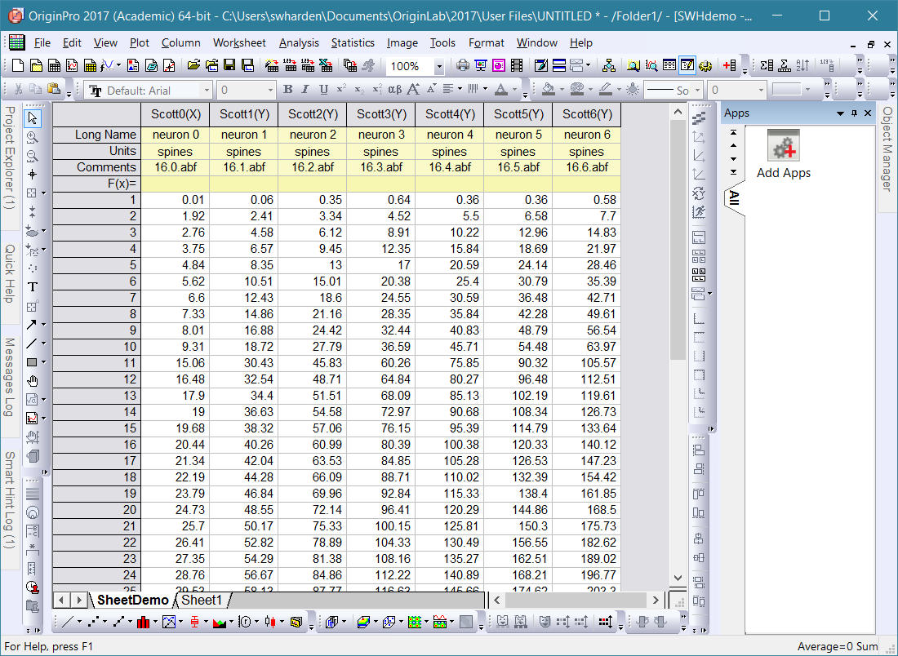

# PyOrigin Examples
A demonstration of how I perform some of the most common tasks using PyOrigin. This readme file generated automatically by running all of the tests in [examples.py](examples.py), saving its output as [output.txt](output.txt), and generating this markdown-formatted summary page thanks to [convert.py](convert.py)

## HTML Rendering of Code and Output
http://pyorigin.swharden.com/PyOrigin-examples.html
_check out that link! It's where all the magic lives_

## Starting Conditions
```python
import PyOrigin # always
import numpy as np # if used
```

## Output
If you run all these tests, the output will look something like this:


